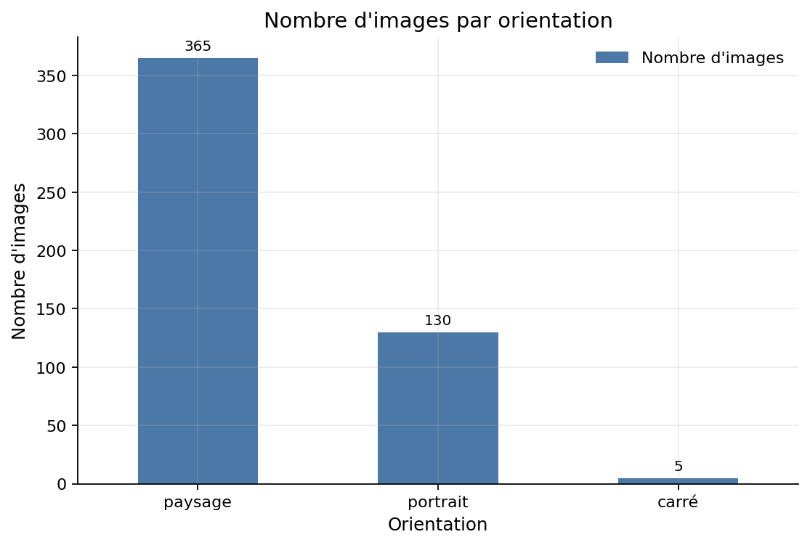
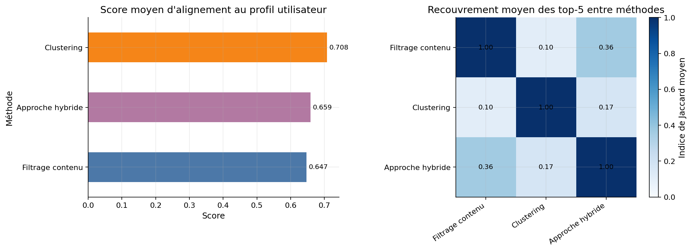

# Rapport de synthèse

**Projet :** Système de recommandation d'images
**Groupe :** Mathis Lambert, Quentin Bouchot, Hugo Rodrigues

## 1. Introduction

L'objectif du projet est de construire un système de recommandation d'images capable de proposer de nouvelles images à partir de préférences utilisateurs. Le travail réalisé couvre toute la chaîne de traitement : collecte des données, annotation automatique, analyse exploratoire, visualisation, modélisation des profils utilisateurs, recommandation et validation par des tests.

Notre approche a consisté à partir d'un jeu de données visuel simple et homogène, puis à transformer chaque image en représentation exploitable par un moteur de recommandation. Nous avons retenu un sous-ensemble de 500 images du dataset **Flowers102** afin de garder une taille suffisante pour obtenir des tendances fiables tout en conservant un temps d'exécution compatible avec un notebook pédagogique. Les préférences utilisateurs ont ensuite été simulées à partir de ces images, ce qui nous a permis de comparer plusieurs méthodes de recommandation sur une même base de travail.

Le projet a été conçu comme un pipeline cohérent : les artefacts produits à chaque étape sont réutilisés dans la suivante. Les métadonnées exportées alimentent l'annotation, les annotations alimentent la construction des profils utilisateurs, et ces profils servent ensuite à générer puis à évaluer les recommandations.

## 2. Collecte de données

Les images proviennent du dataset **`pufanyi/flowers102`** diffusé sur Hugging Face, lui-même basé sur la collection Flowers102. Toutes les images exploitées dans le projet sont associées à une licence **CC-BY-4.0**, ce qui répond à la contrainte de travailler avec des données librement réutilisables. Nous avons sélectionné **500 images** du split d'entraînement.

Pour chaque image, nous avons sauvegardé à la fois le fichier image et un ensemble de métadonnées structurées. Le fichier `images_metadata.json` contient notamment : le nom du fichier, l'identifiant de classe (`label_id`), la largeur, la hauteur, le format, la taille du fichier, l'URL source, le nom de la source ainsi que la licence.

Au terme de cette première étape, nous disposons donc d'un catalogue propre, homogène et réexploitable. Les dimensions observées vont de **500 à 891 pixels** en largeur et de **500 à 1066 pixels** en hauteur, pour une taille moyenne d'environ **59,5 Ko** par image. Le format est entièrement homogène puisque les **500 images sont en JPG**.

## 3. Méthodologie

### 3.1 Annotation et extraction de caractéristiques

L'étape d'annotation vise à transformer les images en descripteurs simples, compréhensibles et utiles pour la recommandation. Nous avons comparé trois approches d'extraction des couleurs dominantes :

- **Méthode A :** clustering global sur tous les pixels de l'image
- **Méthode B :** clustering sur une zone centrale, pour réduire l'impact de l'arrière-plan
- **Méthode C :** segmentation de la fleur par **GrabCut**, puis clustering sur la zone segmentée, avec repli automatique vers la méthode B si la segmentation échoue

Après comparaison qualitative, la méthode C a été retenue. Elle isole mieux l'objet principal et produit des palettes plus pertinentes pour la fleur elle-même que le clustering global. Les annotations finales stockées dans `images_labels.json` contiennent pour chaque image : la méthode d'extraction, les trois couleurs dominantes RGB, leurs poids, leurs noms de couleur approchés, l'orientation, la catégorie de taille et les tags floraux.

Nous avons également justifié les choix de paramètres. Pour le nombre de couleurs, une étape d'analyse sur échantillon a montré qu'un compromis simple et stable était d'utiliser `k = 4` pour les méthodes A et B, et `k = 3` pour la méthode C, une fois la fleur mieux isolée.

### 3.2 Construction des profils utilisateurs

Le projet ne disposant pas de vrais historiques de navigation, nous avons simulé **10 utilisateurs**, chacun associé à **20 images favorites** tirées de manière reproductible. À partir de ces favoris, nous avons construit un profil synthétique comprenant :

- Les couleurs les plus présentes dans les images aimées
- Les tags floraux les plus fréquents
- L'orientation dominante
- La taille dominante
- Un vecteur numérique moyen utilisable par les algorithmes de recommandation

Cette étape a aussi permis d'observer des préférences différenciées entre utilisateurs. Par exemple, certains profils sont dominés par des teintes proches de `darkolivegreen` et `gray`, tandis que d'autres mettent davantage en avant `goldenrod`, `rosybrown` ou `mediumvioletred`. Les utilisateurs ont ensuite été regroupés en **3 clusters** pour analyser leurs proximités globales.

### 3.3 Système de recommandation

Chaque image est représentée dans une matrice de features de **500 images x 192 variables**, réparties en :

- **90 variables de couleur** ;
- **3 variables d'orientation** ;
- **99 variables de tags**.

La variable de taille a finalement été supprimée de la matrice, car toutes les images appartiennent à la même catégorie `moyenne`, donc elle n'apporte aucune information discriminante.

Nous avons comparé trois stratégies de recommandation :

1. **Filtrage basé sur le contenu** : un classificateur `RandomForest` est entraîné pour chaque utilisateur à partir de ses favoris et d'un échantillon d'images non favorites. Cette méthode apprend quels attributs séparent le mieux les images appréciées des autres.
2. **Recommandation par clustering** : toutes les images sont regroupées par `KMeans`, puis nous recommandons des images issues des clusters les plus représentés dans les favoris de l'utilisateur. Le nombre de clusters a été choisi par score de silhouette ; le meilleur compromis observé est **`k = 6`**.
3. **Approche hybride** : les scores du modèle de contenu et du clustering sont normalisés puis combinés pour bénéficier à la fois d'un signal local précis et d'une vision plus globale de la similarité.

La fonction finale `recommend_images` expose une interface unique et renvoie une liste d'images accompagnées d'une justification textuelle.

### 3.4 Visualisations et validation

Le notebook contient plus de six visualisations. Elles couvrent les statistiques de collection (orientation, taille, format), l'analyse des couleurs dominantes, les préférences utilisateurs, les tags les plus fréquents, le choix du nombre de clusters par silhouette ainsi que la comparaison finale des méthodes de recommandation.

Nous avons également consacré une tâche entière aux tests automatiques. Quatre familles de vérifications sont exécutées : cohérence des exports (`images_metadata.json`, `images_labels.json`, `users.json`), reconstruction de la matrice de features, conformité de l'API `recommend_images` et qualité minimale des recommandations. Cette validation garantit que le notebook ne produit pas seulement des figures, mais aussi des artefacts réutilisables et un système cohérent de bout en bout.

### 3.5 Architecture générale

Le pipeline du projet suit la logique suivante : **images brutes -> métadonnées -> annotations visuelles -> profils utilisateurs -> système de recommandation -> tests et évaluation**.

_Figure 1 - Architecture générale du projet._

## 4. Résultats

### 4.1 Tendances globales de la collection

L'analyse exploratoire met en évidence une collection très majoritairement composée d'images en **orientation paysage** : **365 images**, contre **130 portraits** et seulement **5 carrées**. La taille est totalement homogène au niveau de la catégorisation retenue, puisque les **500 images** tombent dans la catégorie `moyenne`. Le format est lui aussi homogène : **100 % des images sont en JPG**.

_Figure 2 - Répartition des images par orientation._

Du point de vue visuel, la couleur la plus fréquente dans les palettes dominantes est **`darkolivegreen`** avec **95 occurrences**, ce qui est cohérent avec un dataset de fleurs contenant souvent des feuilles et fonds végétaux. Le tag floral le plus fréquent est **`passion flower`** avec **17 images**. Ces résultats confirment que le dataset reste visuellement cohérent tout en présentant une diversité suffisante pour différencier les profils utilisateurs.

### 4.2 Qualité des recommandations

Pour évaluer les recommandations, nous avons préféré un critère d'**alignement au profil utilisateur** plutôt qu'une séparation classique train/test. En effet, les utilisateurs sont simulés et leurs favoris ne proviennent pas d'un comportement réel/humain. Nous avons donc construit un score composite reposant sur :

- Le recouvrement avec les couleurs favorites
- Le recouvrement avec les tags favoris
- Le respect de l'orientation dominante
- La similarité moyenne avec le vecteur moyen des favoris

Les résultats moyens sont les suivants :

| Méthode          | Color match | Tag match | Orientation match | Similarité moyenne | Alignement profil |
| ---------------- | ----------: | --------: | ----------------: | -----------------: | ----------------: |
| Filtrage contenu |        0,82 |      0,16 |              0,80 |              0,599 |             0,651 |
| Clustering       |    **0,88** |  **0,16** |          **0,94** |          **0,676** |         **0,717** |
| Hybride          |        0,74 |      0,14 |              0,90 |              0,635 |             0,636 |

La méthode **clustering** obtient les meilleurs résultats globaux sur cet indicateur. Elle présente le meilleur alignement moyen au profil utilisateur (**0,717**), le meilleur recouvrement sur les couleurs favorites (**0,880**) ainsi que la meilleure similarité moyenne (**0,676**). C'est donc elle qui a été retenue comme méthode par défaut dans l'API finale.

_Figure 3 - Comparaison des méthodes de recommandation et recouvrement moyen entre leurs top-5._

Le faible recouvrement moyen entre le filtrage contenu et le clustering (**0,072** pour l'indice de Jaccard moyen sur les top-5) montre que ces deux approches n'explorent pas exactement les mêmes voisins.

### 4.3 Découvertes intéressantes

Trois constats ressortent particulièrement du projet :

- La segmentation par **GrabCut** améliore nettement la pertinence visuelle des couleurs extraites par rapport à un clustering appliqué sur l'image entière
- Malgré un dataset spécialisé sur les fleurs, les profils utilisateurs restent suffisamment différenciés pour rendre la personnalisation intéressante
- Les tags floraux apportent une information utile, mais les **couleurs** jouent ici un rôle beaucoup plus structurant dans la qualité des recommandations

Enfin, la tâche 6 a confirmé la solidité de l'ensemble du pipeline : les tests d'intégrité des données, de reconstruction des features, de cohérence de l'API et de qualité minimale des recommandations passent tous avec succès.

## 5. Limitations et travaux futurs

Le projet présente plusieurs limites. D'abord, les utilisateurs sont **simulés** : leurs préférences ne reflètent pas de vrais comportements, ce qui limite la portée d'une évaluation classique de type précision/rappel. Ensuite, la représentation des images reste volontairement simple : elle repose surtout sur les couleurs, l'orientation et les tags, sans utiliser de descripteurs visuels profonds. De plus, la variable de taille n'apporte rien sur ce sous-ensemble, car toutes les images sont classées dans la même catégorie.

Plusieurs améliorations sont possibles. Une première piste serait de remplacer les profils simulés par de vrais retours utilisateurs ou, à défaut, par des scénarios de préférences plus structurés. Une seconde consisterait à enrichir la représentation avec des embeddings d'image issus d'un modèle pré-entraîné. Enfin, l'approche hybride pourrait être améliorée par un réglage plus fin des pondérations ou par une validation croisée sur des profils d'utilisateurs mieux définis.

## 6. Conclusion

Le projet aboutit à un système complet et cohérent de recommandation d'images : **500 images collectées et documentées**, annotations visuelles exportées, **10 profils utilisateurs** simulés, plusieurs méthodes de recommandation comparées, et une batterie de tests automatique qui valide l'ensemble du pipeline.

Sur le plan méthodologique, le travail est satisfaisant car chaque étape s'appuie explicitement sur la précédente et produit des artefacts réutilisables. La solution retenue n'est pas la plus sophistiquée possible, mais elle est claire, explicable et adaptée au cadre du projet. Notre auto-évaluation est donc positive : le système fonctionne, les résultats sont argumentés, et les limites ont été identifiées de manière honnête.

## 7. Références

- Hugging Face, dataset `pufanyi/flowers102` : <https://huggingface.co/datasets/pufanyi/flowers102>
- Documentation `scikit-learn` pour `KMeans`, `RandomForestClassifier` et le score de silhouette : <https://scikit-learn.org/>
- Documentation `OpenCV` pour `GrabCut` : <https://docs.opencv.org/>
- Documentation `Matplotlib` pour les visualisations et la palette CSS4 : <https://matplotlib.org/>
